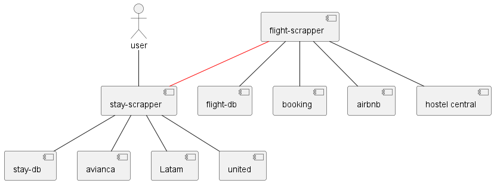

# Title: Scraper as a Service

Objective: Create a set of microservices that allow us to expose a scrapper as a service to create a vacation itinerary
Scope: 
- Find flights by API in different websites
- Find Stays by API in different websites
- Create a recommendation systems
- Deploy using best practices in CI/CD

The idea is to be able to explore different concepts and strategies to be able to see in practice what we can do.

## components Diagram

### Error handling lab

*1. Logs*  
* Add a logger to the project that allow to change the logger level.  
* Change the logger formatted to use the json format.  
* Add labels to the log message that allow you to know the layer (presentation, business, data access).  

*2. Circuit breaker*
* Use the circuit breaker implementation to connect between the  Stay-scrapper and the flight scrapper
* configure the circuit breaker variables using env variables or config properties.

*3. Graceful degradation*
* implement graceful degradation in the stay scrapper so when:
  * If the flight service give a response with 5XX, communicate that the flight list will send in a sms or a email.  
  * If the flight service give a response with a timeout or a 400, give the user the link to the website where he can find the flight tickets.   

